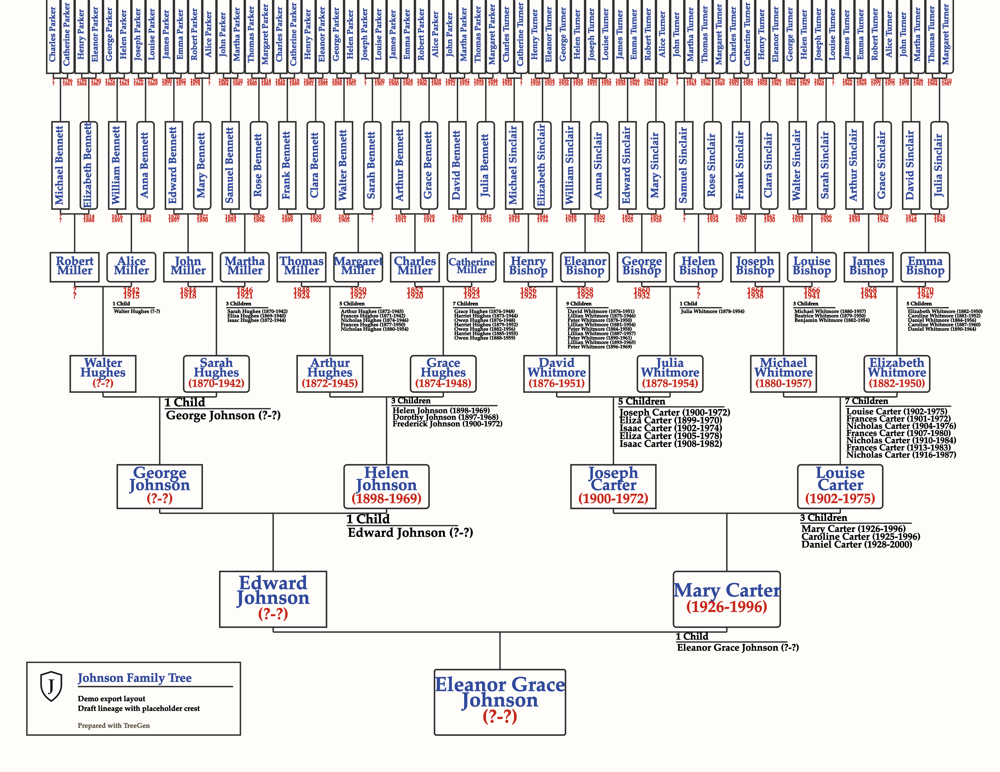

# TreeGen

[Open the demo website](https://vibelabs2048.github.io/treegen/)

[Download for Windows](https://github.com/vibelabs2048/treegen/releases/latest/download/TreeGen-Windows-Setup.exe)

[Download for macOS](https://github.com/vibelabs2048/treegen/releases/latest/download/TreeGen-macOS.dmg)

[Download for Linux](https://github.com/vibelabs2048/treegen/releases/latest/download/TreeGen-Linux.AppImage)

TreeGen is a family-tree editor for building ancestor charts and exporting them as clean print-ready files.

## How to use TreeGen

1. Open the demo site or desktop app.
2. Start with **New Project**, **Load Demo**, or **Open Project**.
3. Click any person box to edit names, dates, marriage dates, and child lists.
4. Use **Save**, **Save As**, **Autosave**, and **Recent Projects** while you work. In the browser, **Save As** also defines the project name used in the recent-project list, and **Recent Projects** can reopen, rename, or remove saved entries.
5. Adjust formatting if needed.
6. Export the finished tree.

## Which version should I use?

- Use the **desktop app** for exact PDF, PNG, and JPG export.
- Use the **demo website** for previewing, editing, YAML import/export, and SVG export.
- On **Windows**, use the setup installer unless you specifically want the portable build from the release page.
- On **macOS**, open the DMG and drag TreeGen into Applications.
- On **Linux**, the AppImage is the simplest option. Mark it executable before opening if needed.

## Example

## Help

If you want the build, packaging, and release details, see [DEVELOPER.md](DEVELOPER.md).
